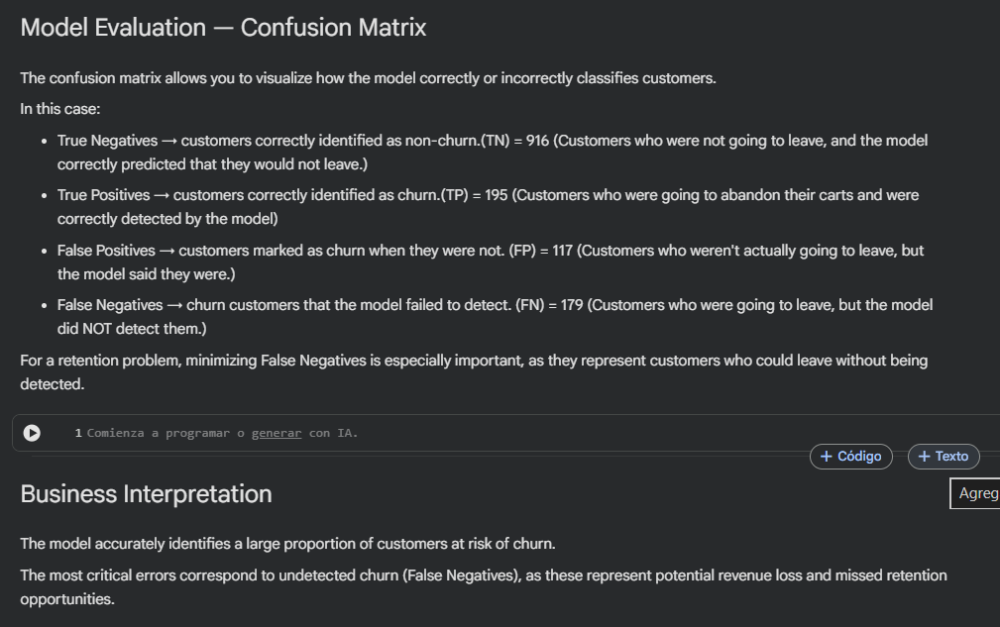

# 📊 Customer Churn Prediction & Retention Modeling

<br>

[](https://postimg.cc/JDTfMKXJ)

<br>

## 📌 Project Overview

This project develops an end-to-end Machine Learning pipeline to predict customer churn and support customer retention strategies.

Starting from raw customer data, the workflow includes data preprocessing, feature engineering, model training, evaluation, and business interpretation, demonstrating how historical customer behavior can be transformed into predictive insights.

<br>

## 🎯 Business Objective

Customer retention is often more cost-effective than customer acquisition.

The objective of this project is to identify customers with a high probability of churn before they leave, enabling businesses to implement proactive retention strategies and optimize marketing resources.

<br>

## 🛠 Technologies Used

- Python
- Pandas
- NumPy
- Scikit-learn
- Matplotlib
- Seaborn
- Jupyter Notebook

<br>

## ⚙ Workflow

```text
Customer Dataset
        ↓
Data Cleaning
        ↓
Feature Engineering
        ↓
Data Preparation
        ↓
Model Training
        ↓
Model Evaluation
        ↓
Customer Churn Prediction
        ↓
Business Interpretation
```

<br>

## 📈 Model Evolution

[](https://postimg.cc/PPqRdmfK)

<br>


## 📸 Application Demo

### Step 1 — Data Preparation

The dataset is cleaned and transformed before training the model.

[](https://postimg.cc/LYzJWYZY)

<br>

### Step 2 — Model Training & Evaluation

The model is trained and evaluated using classification metrics.

#### Confussion Matrix Output 

[](https://postimg.cc/3kz8X8bk)

<br>


### Step 3 — Business Interpretation

The final step focuses on translating model performance into actionable business insights.



<br>

## 🚀 Business Value

### This project demonstrates:

- End-to-End Machine Learning Pipeline
- Customer Churn Prediction
- Data Cleaning & Preparation
- Feature Engineering
- Classification Modeling
- Model Evaluation
- Business-Oriented Interpretation

<br>

## 🧠 Key Learnings

✔ Data Cleaning

✔ Feature Engineering

✔ Data Encoding

✔ Train/Test Split

✔ Logistic Regression

✔ Classification Metrics

✔ Model Performance Evaluation

✔ Business Interpretation

<br>

## 🚀 Future Improvements

✔ Hyperparameter Optimization

✔ Cross Validation

✔ Feature Importance Analysis

✔ Ensemble Models

✔ Explainable AI (SHAP / LIME)

✔ Model Deployment with FastAPI

✔ Interactive Dashboard Integration

✔ Real-Time Predictions

<br>

## 💡 Final Thoughts

This project illustrates that building an effective Machine Learning model is not only about selecting an algorithm.

The most significant improvement was achieved by incorporating business knowledge through feature engineering, demonstrating how domain expertise can directly enhance predictive performance.

Ultimately, successful data science projects combine technical skills with business understanding to generate actionable insights and support better decision-making.
